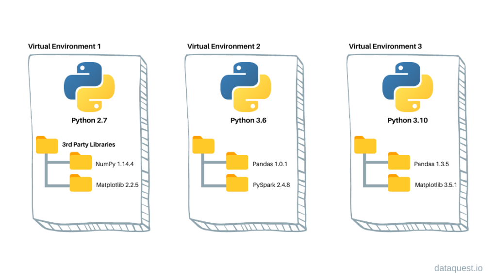
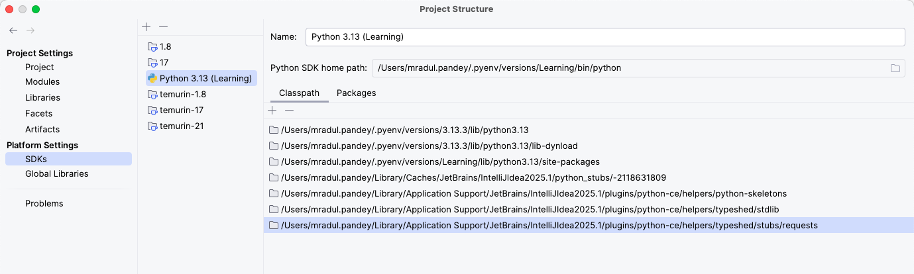

# Setup python environment

#### Understanding python virtual environment
A Python virtual environment is an isolated environment that allows you to install and manage Python packages separately from your system-wide Python installation.

👉 In simple terms:
It creates a "sandbox" where you can install specific versions of libraries without affecting other projects or the global Python environment.



### 1. Setup pyenv virtualenv
```shell
brew install pyenv
brew install pyenv-virtualenv
```
### 2. Add the following to .zshrc
```shell
export PATH="$HOME/.pyenv/bin:$PATH"
eval "$(pyenv init --path)"
eval "$(pyenv init -)"
eval "$(pyenv virtualenv-init -)"
```
### 3. Create python virtual env
```shell
pyenv virtualenv 3.12.3 <myproject>
```

### 4. Auto activate virtualenv
```shell
echo "<myproject>" > .python-version
```

### 5. verify if env is active
```shell
echo $VIRTUAL_ENV
```

### 6. Intellij Setup 

```shell
~/.pyenv/versions/<myproject>/bin/python
```
#### File -> Project Structure ->

